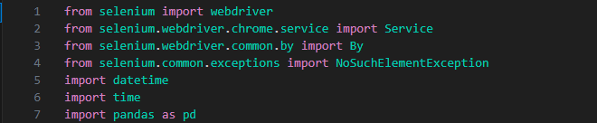

# RTU Sporta centra studentu nodarbību kalendāra pārnešana uz excel (projekta darbs dip225).
# 231RDB019 projekta darbs.

## Apraksts
Sports ir liela daļa no daudzu studentu ikdienas un RTU sporta centrs piedāvā plašu klāstu ar nodarbībām uz, kurām var pieteikties viņu interneta vietnē.
Bieži sanāk meklēt cauri nodarbību kalendāram un meklēt laikus un brīvas vietas, kādi vēl ir pieejami.
Tas atvieglotu šo lēno uzdevumu, ja būtu visi dati par konkrētām sporta nodarbībām savākti pārskatāmi vienuviet.
## Projekta uzdevums
Projekta uzdevums ir izstrādāt Python programmatūru, kas ar tīmekļa skrāpēšanas palīdzību spētu automātiski no RTU sporta centra nodarbību kalendāra pieteikumu mājaslapas "https://www.rtu.lv/lv/sports/sporta-nodarbibas/pieteikties-nodarbibam" nolasīt - no paša lietotāja, pēc izvēles ievadīta notikuma - informāciju, kā datumu, laiku, adresi un pieteikušos dalībnieku skaitu visiem sporta notikumiem līdz nākamās nedēļas beigām. Tālāk šo visu informāciju apvienotu Excel tabulā, pārskatāmā veidā.
## Izmantotās bibliotēkas

1. Selenium. Šī bibliotēka tika izmantota, lai varētu veikt automatizētu tīmekļa skrāpēšanu. Selenium webdriver ar selenium.webdriver.chrome.service ir vissvarīgākā daļa no bibliotēkas, kas atver un kontrolē interneta pārlūka "Google Chrome" logu, lai spētu veikt darbības tajā, kā nospiest pogas vai lai nolasītu informāciju no mājaslapas. Vēl tiek izmantota selenium.webdriver.common.by klase ar, kuras palīdzību tiek meklēti elementi HTML mājaslapas kodā. Visbeidzot selenium.common.exceptions klase ļauj tikt galā ar izņēmumiem, kas rodas, gadījumā, ja meklētais elements mājaslapā netiek atrasts.
2. Datetime. Datetime bibliotēka ir domāta izmantošanai ar datumiem un laikiem. Manā gadījuma tika izmantota nolūkam, lai iegūtu pašreizējā datuma mēneša un dienas skaitļus, kas veido daļu no mājaslapas URL.
3. Time. Bibliotēka tika lietota sleep() funkcijas dēļ, kas veic noteikta garuma pauzi, kurā netiek nekas darīts, lai Selenium webdriver būtu pietiekams laiks, lai pilnībā ielādētu mājaslapu un programma varētu veikt nākamo funkcionalitāti.
4. Pandas. Pandas ir plaši izmantota datu apstrādes Python bibliotēka. Projektā to izmantoja, lai ievākto informāciju par individuālo nodarbību, kura tika glabāta, kā vārdnīca pārveidotu par "DataFrame" ar DataFrame.from_dict funkciju, kas ir līdzīgs tabulai, kuras tika vēlāk apvienotas. Tad vēl bija izmantota to_excel() funkcija mērķim, lai radītu Excel datni no apvienotajām tabulām.
## Izmantošanas metodes

